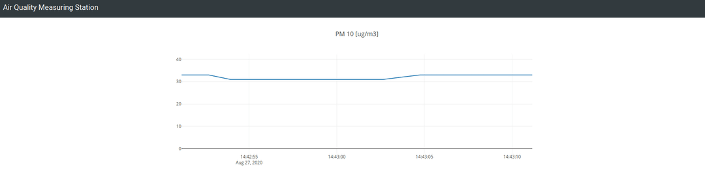

# Smokey. Monitor real-time PM levels in your area.

Real-time PM results in the browser:



# Quickstart

1. Install

```shell
git clone https://github.com/tomek-l/smokey.git
cd smokey
pip3 install -r requirements.txt
python3 main.py
```

2. Navigate your browser to your pi's IP address on port 8888. For me it's: [http://192.168.0.11:8888](http://192.168.0.11:8888). If your pi has avahi installed, [http://raspberrypi.local:8888/](http://raspberrypi.local:8888/) should work too.

3. See real-time PM-level data in your area!

# Run as a service

```
sudo cp smokey.service /etc/systemd/system
sudo systemctl enable smokey.service
```

# Potential issues

1. Make sure the serial port in `config.json` matches the port you connected your PMS7003 to. In most cases it will be `"/dev/serial0"`, so I left that as a default.

## Enable neopixels:

```bash
sudo raspi-config # Interfacting options -> SPI -> enable
``` 
